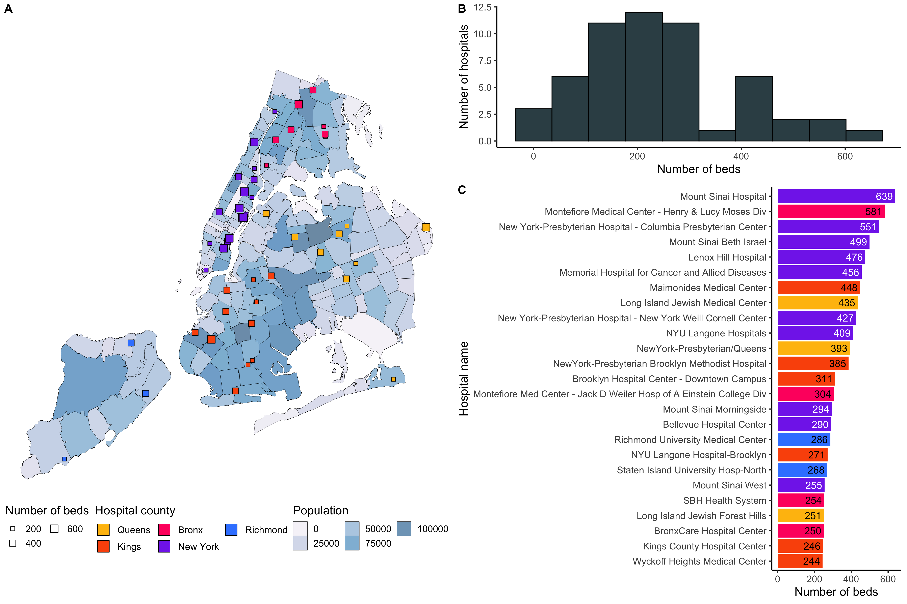
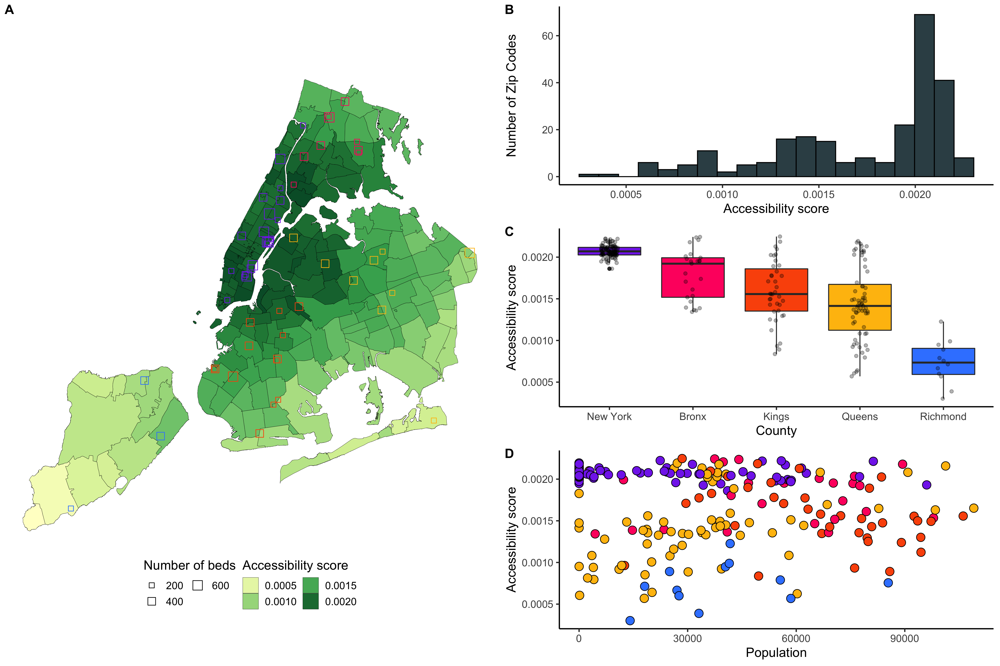
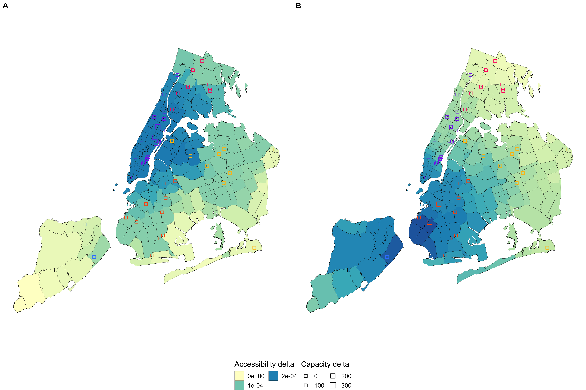

# CAMION: a catchment area maximization algorithm with Linear Programming

## Introduction

Accessibility refers to the relative ease by which services can be reached from a given location (1). Accessibility can be defined by spatial factors, determined by where you are; and non-spatial factors, determined by who you are (2). Spatial accessibility methods assess the availability of supply locations from demand locations, connected by a travel impedance metric. Supply locations are characterized by their capacity or quantity of available resource. Similarly, demand locations are characterized by their population.
Spatial accessibility methods have been successfully applied to health care (3). For this matter, supply locations are health facilities and demand locations are patients’ residence. The impedance metric can be the driving duration between patients’ locations and health facilities.

The most popular method for measuring accessibility is the Two-Step-Floating-Catchment-Area (2SFCA) (4) and its derivatives (1). It is a two-step method, based on gravity models (5), which were judged not intuitive enough by health professionals. The first step computes a provider-to-population ratio for each provider location. In the second step, for each population location, an accessibility score is obtained by summing the provider-to-population ratios. For the algorithm to work, a catchment threshold (distance or travel time) must be set. Above this threshold, a provider location is considered unreachable from the population location, and vice versa. How-ever, the original 2SFCA method does not account for distance decay: a facility is either reachable or not. The Enhanced Two Step Floating Catchment Area (E2SFCA) (6) later addressed this limitation by apply-ing weights to differentiate travel zones in both steps. Intuitively, Floating Catchment Area methods compute a score for each demand location that increases with the proximity of facilities and the availability of their resources.

Uneven distributions of population and health-care providers lead to geographic disparity in accessibility for patients (7). Location-allocation algorithms (8) can optimize the distribution and supply of health providers to reduce disparities. These algorithms seek the optimal placement of facilities for a desirable objective under certain constraints (1). When optimizing health accessibility, there are two competing goals: equity and efficiency (9,10). Equity may be defined as equal access to healthcare for everyone (11). An efficient situation is when everything has been done to help any person without harming anyone else (12). While some argue that efficiency should be addressed in priority (12), others agree that equity is a matter of ethical obligation, especially in public health (13,14).
Regarding efficiency optimization, the most popular algorithms are p-median, lo-cation set covering problem (LSCP) and maximum covering location problem (MCLP). The p-median algorithm minimizes the weighted sum of distances between users and facilities (15). LSCP minimizes the number of facilities needed to cover all demand (16). MCLP maximizes the demand covered within a desired distance or time threshold by locating a given number of facilities (17).
To reach equal access to healthcare, quadratic programming has been used to  minimize the variance of accessibility scores defined by the 2SFCA (18). Similarly, a Particle Swarm Optimization (PSO) algorithm was developed to minimize the total square difference between the accessibility score of each demand location and the weighted average accessibility score (19). Finally, a two-step optimization algorithm has been developed to address the dual objectives of efficiency and equality, by first choosing where to site new hospitals and then deciding which capacity they should have (20,21).

However, most of the previous algorithms seek locations to open new health facilities. In this work, we are interested in the case where the health facilities are fixed, and the only lever to improve accessibility is to increase their capacities. Given a capacity budget, we want to know which facilities to grow and by how much. We introduce CAMION, an accessibility optimization algorithm based on Floating Catch-ment Area and Linear Programming. The initial accessibility score was computed with the Enhanced Two Step Floating Catchment Area (e2SFCA) (6) but our algorithm can generalize to more FCA derivatives. We demonstrated our algorithm on Health Facilities in New York City.

## Datasets

We apply our method to Health Facilities in New York City. We used datasets downloaded from NYC Open Data website , which lists free public data from New York City agencies and other partners. We downloaded the Zip Codes boundaries and census statistics in New York City , provided by the Department of Information Technology & Telecommunications. We retrieved the list of health facilities  in the New York State, as well as their certifications for services and beds  . Both datasets were provided by the New York State Department of Health. We only kept the health facilities located in New York City, with Medical / Surgical beds. Every hospital has Latitude / Longitude coordinates. We used Zip Codes polygons centroids as reference point to compute the travel between Zip Codes and hospitals.
We used the Zip code population as P_i, to encode the demand variable. The supply variable S_u was the number of Medical / Surgery bed for each Health Facility u. We used the geodesic (straight) distance between health facilities coordinates, and Zip Code centroid coordinates as distance matrix.

Download the datasets here:

- [Zip Codes boundaries and census statistics in New York City](https://data.beta.nyc/dataset/nyc-zip-code-tabulation-areas/resource/894e9162-871c-4552-a09c-c6915d8783fb)
- [List of health facilities in NY State](https://health.data.ny.gov/Health/Health-Facility-General-Information/vn5v-hh5r)
- [Health facilities certifications for services and beds](https://health.data.ny.gov/Health/Health-Facility-Certification-Information/2g9y-7kqm)

## Results

**Figure 1: Health facilities with Medical / Surgery beds in New York City.** We included 55 facilities with a total of 13,443 beds. Map (A) shows the geographical location of the facilities, colored by county, and sized by number of beds. The distribution of the number of beds is shown on (B). The top 30 facilities with the highest number of beds are listed on (C) and colored by county. The largest facilities are in New-York County.

**Figure 2: Accessibility to Medical / Surgery beds in New York City.** Accessibility score was computed with the Enhanced Two Step Floating Catchment Area method, with a 45 km maximum catchment area. The geographical distribution of the accessibility score is shown on map (A). Zip codes are colored by accessibility score. Facilities are sized by number of beds and colored by county. The overall accessibility distribution is shown on (B). New-York County has the highest accessibility distribution where Richmond has the lowest (C). Accessibility seems to be higher in dense areas but there is no significant correlation between accessibility and population (D).

**Figure 3: Accessibility delta after running the optimization algorithm.** Both overall and maxi-min optimization algorithms are run. The optimization results are illustrated on maps (A) and (B) respectively. We displayed the accessibility delta as the difference of accessibility after and before the optimization. Every zip code is colored by accessibility delta. The health facilities are displayed as squares, sized accordingly to the capacity increase. The overall optimization increased facilities around New-York and Queens Counties (A). The maxi-min algorithm targeted Richmond facilities in priority (B).

## References

1.  Wang F. Measurement, Optimization, and Impact of Health Care Accessibility: A Methodological Review. Ann Assoc Am Geogr Assoc Am Geogr. 2012;102(5):1104–12.
2. 	Khan AA. An integrated approach to measuring potential spatial access to health care services. Socioecon Plann Sci. 1992 Oct;26(4):275–87.
3. 	Guagliardo MF. Spatial accessibility of primary care: concepts, methods and challenges. Int J Health Geogr. 2004 Feb 26;3(1):3.
4. 	Luo W. Using a GIS-based floating catchment method to assess areas with shortage of physicians. Health Place. 2004 Mar 1;10(1):1–11.
5. 	Joseph AE, Bantock PR. Measuring potential physical accessibility to general practitioners in rural areas: A meth-od and case study. Soc Sci Med. 1982 Jan 1;16(1):85–90.
6. 	Luo W, Qi Y. An enhanced two-step floating catchment area (E2SFCA) method for measuring spatial accessibility to primary care physicians. Health Place. 2009 Dec 1;15(4):1100–7.
7. 	Wang F. Why Public Health Needs GIS: A Methodological Overview. Ann GIS. 2020;26(1):1–12.
8. 	Church RL. Location modelling and GIS. Geogr Inf Syst. 1999;1:293–303.
9. 	Krugman P. Opinion | Why Inequality Matters. The New York Times [Inter-net]. 2013 Dec 16 [cited 2022 May 2]; Available from: https://www.nytimes.com/2013/12/16/opinion/krugman-why-inequality-matters.html
10. Meyer D. Equity and efficiency in regional policy. Period Math Hung. 2008 Mar 1;56(1):105–19.
11. Culyer AJ, Wagstaff A. Equity and equality in health and health care. J Health Econ. 1993 Dec;12(4):431–57.
12. Hemenway D. The Optimal Location of Doctors. N Engl J Med. 1982 Feb 18;306(7):397–401.
13. Fried C. Rights and health care--beyond equity and efficiency. N Engl J Med. 1975;
14. Oliver A, Mossialos E. Equity of ac-cess to health care: Outlining the foun-dations for action. J Epidemiol Community Health. 2004 Sep 1;58:655–8.
15. Murad A, Faruque F, Naji A, Tiwari A. Using the location-allocation P-median model for optimising locations for health care centres in the city of Jeddah City, Saudi Arabia. Geospatial Health. 2021 Oct 19;16(2).
16. Shavandi H, Mahlooji H. A fuzzy queuing location model with a genetic algorithm for congested systems. Appl Math Comput - AMC. 2006 Oct 1;181:440–56.
17. Casado S, Laguna M, Pacheco J. Heuristical labour scheduling to optimize airport passenger flows. J Oper Res Soc. 2005 Jun;56(6):649–58.
18. Wang F, Tang Q. Planning toward Equal Accessibility to Services: A Quadratic Programming Approach. Environ Plan B Plan Des. 2013 Apr 1;40(2):195–212.
19. Tao Z, Cheng Y, Dai T, Rosenberg MW. Spatial optimization of residential care facility locations in Beijing, China: maximum equity in accessibility. Int J Health Geogr. 2014 Sep 1;13(1):33.
20. Luo J, Tian L, Luo L, Yi H, Wang F. Two-Step Optimization for Spatial Accessibility Improvement: A Case Study of Health Care Planning in Rural China. BioMed Res Int. 2017 Apr 18;2017:e2094654.
21. Li X, Wang F, Yi H. A two-step approach to planning new facilities to-wards equal accessibility. Environ Plan B Urban Anal City Sci. 2017 Nov 1;44(6):994–1011.
